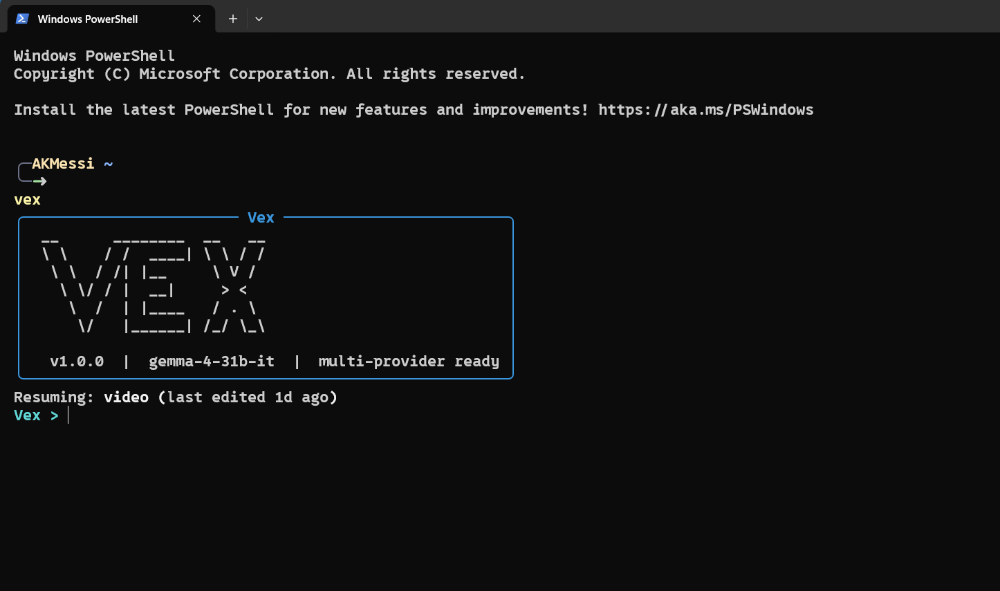

# Vex

<p align="center">
  <strong>Terminal-first AI video editing, driven by plain English.</strong>
</p>

<p align="center">
  <a href="https://github.com/AKMessi/vex"></a>
  
  
  
</p>

<p align="center">
  
</p>

Vex is a source-available, non-commercial AI video editing agent for the terminal. Launch `vex`, talk to it in plain English, point it at a video file, and it edits a safe working copy of your footage using FFmpeg, MoviePy, transcript intelligence, generated visuals, and an LLM-driven tool loop.

It is built for creators and builders who want CLI speed without memorizing editing commands, FFmpeg flags, subtitle workflows, color-correction knobs, or export presets.

## Highlights

| You ask for | Vex handles |
|---|---|
| "Trim the awkward intro and remove pauses." | Timestamp parsing, silence detection, timeline-safe edits, and rebuildable project state |
| "Auto color grade this properly." | Shot-aware exposure, contrast, saturation, white balance, look selection, preview scoring, and output validation |
| "Add subtitle-aware zoom effects." | Caption timing, emphasis scoring, punch-ins, pans, pulses, freeze accents, vignette, flash, focus, and subtitle highlights in one replayable pass |
| "Add visuals where the explanation needs them." | Transcript beat mining, renderer selection, Hyperframes or Manim generation, QA, and compositing |
| "Turn this podcast into shorts." | Shorts Director planning, highlight selection, vertical reframing, captions, hooks, scoring, metadata, and bundle manifests |
| "Convert this MOV to MP4 and compress it." | Metadata inspection, encode planning, safe FFmpeg command generation, confirmation, and validation |

## Why Vex

- Natural language first: describe the edit you want instead of memorizing tool syntax
- Safe by design: original footage stays untouched while Vex edits a project working copy
- Stateful projects: resume later with timeline history, undo, redo, and rebuild support intact
- Real editing operations: trims, overlays, audio edits, subtitle burn-in, silence cleanup, exports, and more
- Production-minded auto color grading: sampled-frame analysis builds reusable FFmpeg grades with shot-aware candidate scoring and validation
- Subtitle-aware auto effects: caption beats can trigger punch-ins, punch-outs, slow pushes, pans, pulses, freeze accents, subtle shake, vignette, flash, focus, and subtitle-safe highlights
- Transcript-aware visuals: Vex can plan explanatory inserts from narration, generate them with Hyperframes, Manim, or typed Blender 3D asset templates, and composite them back into the cut
- Plain-English encoding: messy export requests become inspected, validated FFmpeg plans before anything runs
- Multi-provider ready: Gemini by default, Claude or local OpenAI-compatible providers when configured
- Live run status: see the active tool, progress, and optional trace artifacts while the agent works
- Terminal-native: fast, scriptable, and easy to integrate into existing workflows

## Contents

- [What Vex Can Do](#what-vex-can-do)
- [What's New: Auto Visuals](#whats-new-auto-visuals)
- [Auto Color Grading](#auto-color-grading)
- [Installation](#installation)
- [Configuration](#configuration)
- [Quick Start](#quick-start)
- [Natural-Language Examples](#natural-language-examples)
- [Full Tool Surface](#full-tool-surface)
- [CLI Commands](#cli-commands)
- [Architecture](#architecture)
- [Troubleshooting](#troubleshooting)

## What Vex Can Do

### Core editing

- Inspect video metadata
- Trim clips by timestamp
- Merge multiple clips
- Adjust playback speed for a full clip or a selected segment
- Add fade in, fade out, and fade-through-black transitions
- Add timed text overlays
- Remove silent gaps from raw footage
- Extract selected highlight segments into a shorter cut
- Auto color grade with natural, vibrant, cinematic, warm, cool, documentary, or punchy looks

### Audio

- Extract audio as `mp3`, `wav`, or `aac`
- Replace a video's audio track
- Mix external audio with original audio
- Mute a selected time range

### Captions and transcript workflows

- Transcribe video locally with Whisper
- Generate `transcript.txt` and `transcript.srt`
- Burn subtitles directly into the video from an SRT file
- Auto-summarize long clips into highlight cuts using transcript-aware segment selection
- Auto-create multiple vertical shorts with a typed Shorts Director v3 program, graph-searched multi-source edit plans, captions, ranking, hooks, metadata, and a bundle manifest
- Score candidate clips with a shared local Video Understanding Graph for retention, visual opportunity, topic alignment, hook strength, payoff, novelty, clarity, shareability, standalone story completeness, pacing, and topic diversity before final selection
- Run pre-render edit-plan validation plus final transcript quality gates so abrupt, incoherent, invalid, or weak-payoff cuts are rejected before the final manifest
- Generate timestamped B-roll suggestions for each short
- Fetch and splice subtitle-aligned, transcript-aware stock B-roll from configured providers such as Pexels, Pixabay, and Coverr into the working video
- Add context-aware auto emphasis effects from full-video rhythm, transcript timing, scene stability, pacing, pauses, questions, numeric claims, contrast turns, and payoff lines
- Generate transcript-aligned custom visuals and animations with Hyperframes-first HTML motion slides, typed Blender 3D assets, and Manim retained for specialist math/geometry scenes
- Generate brand-new audio-synced HyperFrames videos from a prompt or script without loading a source video
- Add transcript-driven punch-in moments for emphasis inside generated shorts
- Record local creative-run history with graph versions, quality scores, manifest paths, and output artifacts for shorts, visuals, and color grading
- Optimize Auto Visuals as a coherent semantic portfolio, compare compatible renderers by measured output quality, learn bounded project-local quality priors, and verify the final encoded composite before changing project state

## Local Creative Intelligence

Vex now builds a shared local `VideoUnderstandingGraph` for the highest-level creative automation paths. Auto shorts, auto visuals, and auto color grading no longer depend only on isolated feature heuristics; they share local evidence about transcript beats, retention moments, topic weights, scene cuts, quality contracts, and graph-backed scoring.

Each successful creative run records:

- a feature manifest with the creative graph or graph summary
- a creative QA report with score, pass/review status, issues, warnings, metrics, and evidence
- a local `creative_runs.json` registry entry in the project working directory
- dashboard and CLI visibility through `/creative-runs` or `vex creative-runs --project <project-id>`

## What's New: Auto Visuals

`add_auto_visuals` is the biggest recent addition to Vex.

Instead of only fetching stock footage, Vex can now:

- transcribe a talking-head or explainer video
- segment long transcripts into semantic episodes before scoring which spoken
  windows deserve a custom visual
- preflight source-grounded opportunity contracts through the HyperFrames
  semantic compiler before expensive scene authoring
- schedule a globally coherent visual set with episode-aware reserves instead
  of independently selecting the highest-scoring subtitle lines
- build a video-level visual narrative program with chapters, concept memory, continuity groups, and transition intent
- plan where a full-screen replacement is safe versus where picture-in-picture is smarter
- compile transcript evidence into typed facts, explanation objects, semantic beats, and explicit rejection reasons
- select a role-constrained semantic blueprint and sign a production contract before Hyperframes receives a render spec
- generate transcript-aligned custom visuals with a deterministic Hyperframes HTML renderer
- compile every Hyperframes scene through a typed design IR for art direction, density, theme, safe areas, and motion intensity
- carry episode context, visual beats, recurring concepts, and transition contracts into Hyperframes metadata
- ground interface walkthroughs in real captured source frames when the source contains a screen or slide
- render multiple art-directed variants, inspect semantic state at four times, score extracted frames for contrast, occupancy, dead space, edge safety, and motion, then promote only a passing version
- lint, validate, and render those scenes before the final composite
- optimize the complete visual set for quality, semantic coverage, diversity, and clean timing instead of truncating candidates by timestamp
- substitute a preflighted reserve when a primary scene fails compilation,
  rendering, or final timeline QA
- remember failed source moments inside the project so retries do not repeat
  the same rejected visual concept
- compare compatible renderer outputs through a bounded quality tournament when renderer routing is flexible
- verify the final encoded replacement frames, duration, resolution, file integrity, and audio before project-state promotion
- learn conservative project-local renderer and intent priors from repeated render QA outcomes without bypassing hard gates
- fall back to specialist renderers only when a scene needs a different engine
- render deterministic Blender 3D assets from typed specs for titles, labels, pointers, product spins, object orbits, logo reveals, and data tunnels without allowing raw Blender Python from the agent

The current renderer stack is:

- `hyperframes` for premium HTML/CSS motion slides, process diagrams, product UI scenes, comparisons, timelines, data-driven explainers, causal chains, flywheels, decision matrices, anatomy cutaways, rankings, contrast ladders, proof sequences, and narrative arcs with built-in variant QA
- `manim` for formula-heavy math, geometry, axes, and visuals that genuinely need Manim's object model
- `ffmpeg` for fast editorial overlays and clean picture-in-picture support graphics
- `blender` for optional deterministic 3D assets when Blender is installed. Vex owns timing, project state, undo/rebuild, and final FFmpeg compositing; Blender only renders the visual asset.

Best results today:

- short and long-form explainers, tutorials, essays, and talking-head videos
- beats with clear process, contrast, numbers, or "how it works" structure
- multi-sentence windows with enough local evidence and screen time for a
  custom visual to actually add intuition

Vex deliberately tries to skip weak beats instead of forcing generic filler.

The complete implementation report is in
[docs/feedback-driven-automation-report.md](docs/feedback-driven-automation-report.md).
The repository-wide quality architecture continuation is in
[docs/creative-quality-architecture-report.md](docs/creative-quality-architecture-report.md).
The HyperFrames director skill pack is in
[skills/vex-hyperframes-director](skills/vex-hyperframes-director).
The counterexample-guided repair skill pack is in
[skills/vex-hyperframes-visual-repair](skills/vex-hyperframes-visual-repair).

## Auto Color Grading

`auto_color_grade` analyzes sampled frames from the current working cut, builds a deterministic Color Grade Director plan, and applies a reusable FFmpeg filter graph. The timeline stores the exact filter graph, so undo, redo, and project rebuilds do not depend on re-running analysis.

It corrects:

- exposure and gamma drift
- low contrast or overly harsh contrast
- muted saturation
- red, green, or blue color casts through bounded white balance
- weak black/white points with guarded level normalization
- flat footage with subtle look-aware contrast curves
- screen recordings, talking heads, product shots, low-light shots, and already-graded footage with subject-aware protection budgets

The analyzer weights reliable frames, skips flat transition frames, estimates white balance from neutral midtones instead of saturated image regions, and guards saturation/channel changes when skin-tone-like pixels are present. The Color Grade Director classifies each shot, picks an auto-look policy, caps risky saturation/contrast/gamma changes for UI and skin, scores multiple preview candidates, and smooths similar neighboring shots so the grade does not flicker between scenes.

After rendering, Vex samples the graded output again and records a validation score with warnings for remaining clipping, low contrast, extreme brightness, or risky saturation. The color-grade tool also attaches a local creative QA report that combines output validation, shot validation, director metadata, candidate scoring, preview coverage, correction strength, and warnings into one publishability signal.

Supported looks are `auto`, `natural`, `vibrant`, `cinematic`, `warm`, `cool`, `documentary`, and `punchy`.

### Export and delivery

- Export with built-in presets for YouTube, Instagram, TikTok, X, and podcast audio
- Plan plain-English FFmpeg encode, conversion, compression, and target-size commands before running them
- Validate encoded files with `ffprobe` plus a full FFmpeg decode pass before reporting success
- Export directly from the REPL or from the CLI
- Estimate output size and check disk space before export

### Project system

- Persistent saved projects
- Auto-load a project when you mention a known video path
- Deterministic project loading
- Undo and redo through timeline rebuild
- Timeline inspection and project summaries

## The Intended Experience

This is the default workflow:

```text
> vex

[Vex banner]
Vex > trim the first 30 seconds of "D:\videos\clip.mp4"
Vex > remove awkward pauses
Vex > burn subtitles
Vex > export it for instagram
Vex > /quit
```

You do not need to type subcommands inside the session.

If no project is loaded, include a video path in your first message and Vex handles the rest.

During each turn, Vex shows a live status spinner with the active tool name. If you want the deeper activity log afterward, use `/trace`.

## Installation

### Requirements

- Python 3.11+
- FFmpeg installed and available on `PATH`
- `yt-dlp` available through the Python environment for YouTube downloads
- `openai-whisper` is optional and only needed for local transcription
- Node.js 22+ and npm are required only for HyperFrames-powered generated visuals
- `manim` is optional for specialist math, geometry, and axes-heavy generated visuals
- `blender` is optional if you want typed 3D titles, transparent overlays, product/model spins, logo reveals, object orbits, and cinematic replacement shots; set `BLENDER_PATH` to `blender`, a full executable path, or a Blender install directory if it is not already on `PATH`

FFmpeg install:

- macOS: `brew install ffmpeg`
- Ubuntu/Debian: `sudo apt install ffmpeg`
- Windows: install from `https://ffmpeg.org/download.html` and add `ffmpeg/bin` to `PATH`

### Install Vex

`pipx` is the recommended installation method because it gives Vex an isolated
Python environment while keeping the `vex` command available globally:

```bash
pipx install vex-video
```

Standard `pip` installation is also supported:

```bash
python -m pip install vex-video
```

Optional feature sets:

```bash
pipx install "vex-video[transcription]"
pipx install "vex-video[manim]"
pipx install "vex-video[all]"
```

For an existing pipx installation, install Whisper into Vex's isolated
environment with:

```bash
vex setup transcription
```

Vex also discovers a `python` or `python3` executable on `PATH` that already
contains Whisper. Set `WHISPER_PYTHON_PATH` when the intended interpreter is
not the first one on `PATH`.

For a source checkout used for development:

```bash
git clone https://github.com/AKMessi/vex.git
cd vex
python -m pip install -e ".[dev]"
```

Verify the installation:

```bash
vex --version
vex renderers doctor
```

For HyperFrames visuals, install Vex's version-locked renderer runtime explicitly:

```bash
vex renderers install hyperframes
```

This runs `npm ci` from the lockfile shipped with the installed Vex version. Vex
does not silently install Node packages during `pip install` or first launch.

See [docs/installing.md](docs/installing.md) for upgrades, release candidates,
rollbacks, optional features, and uninstall behavior.

### Windows PATH note

Run `pipx ensurepath`, restart the terminal, and retry. For a standard `pip`
installation, add your Python Scripts directory to `PATH`.

Example:

```text
C:\Users\aarya\AppData\Roaming\Python\Python314\Scripts
```

Your path may differ depending on your Python installation.

## Configuration

Create a local configuration template without needing a source checkout:

```bash
vex setup config
```

Vex refuses to overwrite an existing `.env` unless `--force` is supplied.
Then configure your provider in that file.

### Default provider

Vex defaults to Gemini.

```env
PROVIDER=gemini
GEMINI_API_KEY=your_key_here
GEMINI_MODEL=gemma-4-31b-it
```

### Claude support

If you want Claude instead:

```env
PROVIDER=claude
ANTHROPIC_API_KEY=your_key_here
```

### Local LLM support

Vex can also use local OpenAI-compatible servers such as Ollama, LM Studio, and llama.cpp:

```env
PROVIDER=ollama
OLLAMA_BASE_URL=http://localhost:11434/v1
OLLAMA_MODEL=qwen2.5-coder:14b
```

See [docs/local-llms.md](docs/local-llms.md) for the full setup guide and troubleshooting notes.

### Important settings

- `PROVIDER`
- `GEMINI_API_KEY`
- `GEMINI_MODEL`
- `ANTHROPIC_API_KEY`
- `CLAUDE_MODEL`
- `OPENAI_COMPAT_BASE_URL`
- `OPENAI_COMPAT_MODEL`
- `OLLAMA_BASE_URL`
- `OLLAMA_MODEL`
- `LM_STUDIO_BASE_URL`
- `LM_STUDIO_MODEL`
- `LLAMA_CPP_BASE_URL`
- `LLAMA_CPP_MODEL`
- `PEXELS_API_KEY`
- `PIXABAY_API_KEY`
- `COVERR_API_KEY`
- `AUTO_BROLL_PROVIDERS` defaults to `auto`; use `pexels`, `pixabay`, `coverr`, or comma-separated names to control stock B-roll provider order
- `AUTO_BROLL_MAX_OVERLAYS` defaults to `24`
- `AUTO_VISUALS_MAX_VISUALS` defaults to `32`
- `AGENT_PROJECTS_DIR`
- `FFMPEG_PATH`
- `ENCODE_VALIDATION_TIMEOUT_SEC`
- `BLENDER_PATH`
- `BLENDER_RENDER_TIMEOUT_SEC` defaults to one hour; set it to `0` to disable the Blender process timeout
- `HYPERFRAMES_RENDER_TIMEOUT_SEC` defaults to `0`, which disables the Hyperframes process timeout; set a positive value to enforce one
- `HYPERFRAMES_VARIANT_COUNT` controls legacy/manual art-direction variants, capped at `5`
- `HYPERFRAMES_PROOF_CANDIDATE_COUNT` controls automatic structural proof candidates, capped at `8`
- `HYPERFRAMES_MIN_QUALITY_SCORE` controls variant promotion
- `HYPERFRAMES_QA_MODE` accepts `local`, `hybrid`, or `vision`
- `HYPERFRAMES_ENABLE_VISION_QA` enables blind inverse-decoder QA
- `HYPERFRAMES_ENABLE_COUNTERFACTUAL_QA` enables relation-ablation and temporal-scramble probes
- `HYPERFRAMES_BLIND_DECODER_MIN_SCORE` sets the independent semantic decode floor
- `HYPERFRAMES_VISION_MODEL` optionally selects the model used for blind decoding
- `HYPERFRAMES_ENABLE_CEGIS` enables typed counterexample-guided visual repair
- `HYPERFRAMES_MAX_CRITIC_FRAMES` controls adaptive semantic captures, default `8`, capped at `12`
- `HYPERFRAMES_MAX_REPAIR_ROUNDS` controls monotonic repair attempts, default `3`, capped at `5`
- `HYPERFRAMES_MIN_REPAIR_DELTA` sets the minimum composite improvement when hard failures are unchanged
- `WHISPER_MODEL`

## Quick Start

### First run

```bash
vex
```

Then type a normal sentence with a video path:

```text
Vex > trim the first 30 seconds of "D:\videos\clip.mp4"
```

Then continue naturally:

```text
Vex > remove the silent pauses
Vex > add "DealScout" at the bottom for the first 4 seconds
Vex > export it for youtube
Vex > /quit
```

### If a project already exists

- If exactly one saved project exists, Vex resumes it automatically
- If multiple saved projects exist, Vex starts clean and waits for a file path or an explicit project command
- If you mention a video path that already belongs to a saved project, Vex reuses that project instead of creating a duplicate

## Natural-Language Examples

### Basic trim

```text
Vex > trim the first 15 seconds of "D:\videos\intro.mp4"
```

### Speed up a section

```text
Vex > speed up the section from 1:10 to 1:35 by 1.25x
```

### Remove pauses

```text
Vex > remove the silent gaps
```

### Add subtitles

```text
Vex > transcribe this video
Vex > burn subtitles in yellow at the bottom
Vex > add cinematic subtitles
Vex > add creator bold captions for shorts
```

### Summarize a long video

```text
Vex > make this a 60 second highlight reel
```

### Create viral-style shorts

```text
Vex > turn this podcast into 4 YouTube Shorts with captions
```

Auto shorts can build either one continuous clip or a stitched edit plan from multiple source ranges. Vex keeps the timeline and FFmpeg render path in control; the Shorts Director chooses typed source ranges, hard cuts, punch-ins, caption emphasis, and contextual visual insert intent, then validates the plan before rendering.

### Create shorts from a YouTube link

```text
Vex > make 3 shorts from https://www.youtube.com/watch?v=example123
```

### Add stock B-roll automatically

```text
Vex > add auto b-roll from Pexels to this video
Vex > add auto b-roll using Pixabay and Coverr
Vex > add 4 stock cutaways that match the narration
```

`add_auto_broll` uses B-roll Director v2. It builds a video-level context graph, turns transcript beats into typed visual intents, searches all configured stock providers by default, verifies candidate visual fit, and runs a final abruptness/semantic QA gate before rendering. Set one or more of `PEXELS_API_KEY`, `PIXABAY_API_KEY`, and `COVERR_API_KEY`, then optionally control provider order with `AUTO_BROLL_PROVIDERS=auto` or a comma-separated list such as `pexels,pixabay`. Vex normalizes candidates from each provider, reranks them against the active subtitle and nearby transcript context, caches the chosen clip locally, and writes `stock_attribution.md` in the run bundle.

### Add generated visuals automatically

```text
Vex > add precise generated visuals wherever the explanation needs them
Vex > create custom animations for the key claims and process steps in this video
Vex > use clean product-style generated visuals for the UI explanations
```

`add_auto_visuals` now uses a transcript-aware planner, a video-level visual narrative program, context-aware visual budgeting, source-frame visual-need scoring, premium template upgrades, renderer auto-selection, and a Hyperframes-first generation path. If the transcript has many high-signal visual opportunities, Vex can plan a denser sequence instead of stopping after one or two inserts. Today it can choose between:

- `hyperframes` for premium HTML/CSS motion slides, diagrams, flows, comparisons, UI explainers, causal chains, flywheels, decision matrices, anatomy cutaways, rankings, proof sequences, narrative arcs, concept maps, problem/solution pivots, myth-busters, checklists, radar scans, opportunity maps, scorecards, pipeline X-rays, decision trees, momentum waves, focus rings, filmstrip timelines, quote breakdowns, market maps, mechanism blueprints, data pulses, and data-heavy visual inserts
- `manim` for formula-heavy math, geometry, axes, and specialist vector animation
- `ffmpeg` for fast, clean editorial cards and picture-in-picture support graphics
- `blender` for deterministic 3D titles, transparent overlays, object/model shots, logo reveals, product spins, and cinematic data/abstract inserts when Blender is installed

Suggested prompts:

```text
Vex > add auto visuals
Vex > add auto visuals with hyperframes
Vex > add auto visuals with manim
Vex > add auto visuals with both hyperframes and manim
Vex > add custom animations only where they make the explanation clearer
Vex > use generated visuals for the process beats and keep everything else clean
Vex > add a rotating 3D title saying Matrix Multiplication at 00:18
Vex > add a floating 3D arrow pointing to the chart on the right from 00:12 to 00:16
Vex > add a cinematic glowing chip animation when I say GPU
Vex > add a 3D product spin overlay using assets/model.glb from 5s to 9s
```

Blender 3D support is opt-in and typed. The agent can choose a template and parameters, but Vex compiles those parameters into internal deterministic Blender Python. It never asks the LLM to emit raw Blender scripts.

Supported Blender templates:

- `three_d_title`
- `floating_3d_label`
- `object_orbit`
- `logo_reveal`
- `screen_pointer_3d`
- `data_tunnel`
- `product_model_spin`
- legacy Blender templates: `quote_focus`, `keyword_stack`, `metric_callout`

Composition modes:

- `replace` renders a normal full-screen MP4 insert that Vex cuts into the timeline.
- `overlay` renders transparent Blender frames, encodes an alpha-capable asset, and lets Vex composite it with FFmpeg over the source video.

Supported local 3D model formats are `.glb`, `.gltf`, `.obj`, and `.blend`. Asset paths must stay inside the project or workspace-safe input roots. Blender remains optional; if it is unavailable, non-3D auto visuals continue to use Hyperframes, Manim, or FFmpeg as appropriate.

Hyperframes tuning:

- Plain `add auto visuals` in the agent asks you to choose `hyperframes`, `manim`, or `both` before rendering.
- `renderer=hyperframes` is strict Hyperframes-only and will not fall back to Manim.
- `renderer=manim` is strict Manim-only and will not fall back to Hyperframes.
- `renderer=both` lets Vex choose between Hyperframes and Manim per visual.
- Auto Visuals Director v3 samples tiny source frames, scores whether the moment actually needs a generated insert, rejects weak semantic matches, and drops rendered Hyperframes/Manim outputs that fail renderer QA before compositing.
- Auto Visuals uses deterministic set optimization before and after rendering, so stronger and more diverse candidates can replace weaker or overlapping candidates.
- Flexible `auto` and `both` runs use bounded renderer quality tournaments; strict renderer requests remain strict.
- Auto Visuals and Auto B-roll run shared encoded-composite QA before state mutation.
- `AUTO_VISUALS_RENDERER_TOURNAMENT_SIZE` controls successful contenders per flexible visual, default `2`, capped at `3`.
- `VISUAL_COMPOSITE_SIMILARITY_FLOOR` controls replacement-frame publish similarity, default `0.72`.
- Full-screen generated replacements receive soft transition handles automatically so the compositor avoids abrupt slide cuts when the plan did not specify transitions.
- `HYPERFRAMES_PROOF_CANDIDATE_COUNT` controls how many structurally distinct proof programs Auto Visuals renders, capped at 8
- `HYPERFRAMES_VARIANT_COUNT` remains the legacy/manual art-direction variant control
- `HYPERFRAMES_MIN_QUALITY_SCORE` sets the promotion threshold used by extracted-frame QA
- `HYPERFRAMES_QA_MODE` records whether the run should be treated as `local`, `hybrid`, or `vision` QA
- `HYPERFRAMES_ENABLE_COUNTERFACTUAL_QA` tests whether relation geometry and time order are necessary for comprehension
- `HYPERFRAMES_BLIND_DECODER_MIN_SCORE` sets the blind semantic recovery threshold
- `HYPERFRAMES_RENDER_QUALITY` can be set to `draft`, `standard`, `high`, or left empty for the Hyperframes default
- `HYPERFRAMES_RENDER_TIMEOUT_SEC` defaults to `0`, which disables the Hyperframes render timeout

See [HyperFrames Visual Proof Search](docs/hyperframes-visual-proof-search.md) for the
claim graph, structural tournament, blind inverse decoder, counterfactual QA, and
promotion architecture.
See [HyperFrames Counterexample-Guided Visual Synthesis](docs/hyperframes-visual-cegis.md)
for Scene Program V2, typed critics, safe patches, monotonic repair, and independent
final judging.

### Add subtitle-aware effects automatically

```text
Vex > add subtitle-aware auto effects
Vex > add strong zoom effects where the captions need emphasis
Vex > add subtle camera-only effects, no style accents
```

`add_auto_effects` treats subtitle/caption timing as the source of truth. It scores each subtitle beat for hooks, questions, numbers, contrast turns, payoff language, pauses, and nearby scene cuts, then sends the selected beats through Auto Effects Director. The director chooses a taste profile, converts effects into a bounded camera-motion plan, softens unsafe zooms/shakes/flashes, validates the motion path, renders one deterministic FFmpeg pass, and samples tiny rendered preview frames before accepting the output. Effects include `punch_in`, `punch_out`, `slow_push`, `micro_pan`, `snap_reframe`, `impact_pulse`, `freeze_accent`, `subtle_shake`, `vignette`, `flash_accent`, `focus_blur`, and `subtitle_highlight`.

Taste profiles can be requested with `taste_profile` / `effect_taste_profile` when calling the tool, or `--taste-profile` in the CLI: `clean_documentary`, `viral_commentary`, `tutorial_focus`, `cinematic_subtle`, or `high_energy_shorts`. If omitted, Vex infers one from rhythm, density, intensity, duration, and aspect ratio.

### Export for social

```text
Vex > export it for instagram
```

### Auto color grade

```text
Vex > auto color grade this video
Vex > give it a subtle cinematic look
Vex > make the colors pop
```

## Full Tool Surface

These are the editing tools Vex exposes to the agent loop.

| Tool | What it does |
|---|---|
| `get_video_info` | Reads duration, resolution, fps, codec, audio presence, format, and size |
| `trim_clip` | Trims the current working video to a selected range |
| `merge_clips` | Concatenates the current working clip with one or more external clips |
| `adjust_speed` | Changes playback speed globally or for a selected segment |
| `add_transition` | Adds `fade_in`, `fade_out`, or fade-through-black style transitions |
| `add_text_overlay` | Adds timed text overlays to the video |
| `extract_audio` | Exports audio from the current working video |
| `replace_audio` | Replaces or mixes audio with an external track |
| `mute_segment` | Silences audio in a selected time range |
| `trim_silence` | Detects and removes dead-air pauses while preserving natural speech handles by default |
| `auto_color_grade` | Samples frames, builds a Color Grade Director plan with subject protection and scene smoothing, applies a reusable FFmpeg grade, stores the filter for rebuilds, and records creative grade QA |
| `burn_subtitles` | Compiles SRT captions into styled ASS subtitles and burns them into the video |
| `transcribe_video` | Generates `transcript.txt` and `transcript.srt` using Whisper |
| `summarize_clip` | Uses transcript-aware LLM selection to build a shorter highlight cut |
| `create_auto_shorts` | Builds Shorts Director v4 programs from semantic transcript units, plans complete stories chapter by chapter, deterministically compiles exact source ranges, runs cold-viewer and render QA, and promotes prevalidated reserves when a primary short fails |
| `add_auto_broll` | Uses B-roll Director v2 to plan typed, graph-aware stock cutaway intents, searches configured providers, verifies visual fit, runs final QA, writes attribution, and splices approved clips into the current working video |
| `add_auto_visuals` | Compiles transcript evidence into signed semantic render contracts, rejects unsupported filler, generates custom visuals with the best supported renderer, records semantic/render QA, and composites approved assets |
| `add_visual_asset` | Inserts a project-safe local HTML, video, GIF, or image asset at an exact time without transcript scoring |
| `add_auto_effects` | Scores subtitle beats and applies replayable camera and style emphasis effects in a single FFmpeg pass |
| `upscale_video` | Scales and exports with FFmpeg Lanczos using `fit`, `fill`, or explicit `stretch` |
| `renderers_doctor` | Reports HyperFrames, Node.js, FFmpeg, Manim, and Blender availability and versions |
| `plan_encode` | Turns plain-English encode, conversion, and compression requests into a pending FFmpeg command |
| `run_pending_encode` | Executes the latest confirmed encode plan after the user replies `yes` |
| `export_video` | Exports the working video with a named preset |
| `undo` | Rebuilds the project without the last operation |
| `redo` | Reapplies the most recently undone operation |

Inside the REPL, you can also use `/trace` to inspect the latest recorded agent trace for the current project.
Use `/creative-runs` to inspect recent local creative automation runs for the active project.

## CLI Commands

Vex supports both a conversational mode and explicit power-user commands.

### `vex`

Start the interactive REPL.

### `vex shorts`

Generate a packaged shorts bundle directly from an existing project.

```bash
vex shorts --project <project-id> --count 4 --target-platform youtube_shorts
```

Add `--subtitle-style glass` or another subtitle preset to change the burned caption look for the generated shorts.

### `vex auto-broll`

Plan and apply provider-backed stock footage inserts to an existing project.

```bash
vex auto-broll --project <project-id> --max-overlays 5
vex auto-broll --project <project-id> --providers pixabay,coverr --max-overlays 5
vex auto-broll --project <project-id> --max-overlays 15 --coverage-policy target_count
```

### `vex auto-visuals`

Plan and apply generated supporting visuals to an existing project.

```bash
vex auto-visuals --project <project-id> --max-visuals 4 --renderer auto --style-pack editorial_clean
vex auto-visuals --project <project-id> --renderer hyperframes
vex auto-visuals --project <project-id> --renderer both
vex auto-visuals --project <project-id> --max-visuals 18 --coverage-policy target_count --density chapter_coverage
```

Generic requests use `quality_only`. Explicit counts use `target_count`; `exact_count`
raises coverage pressure but still cannot bypass path, render, semantic, or QA failures.

### `vex generate-video`

Generate a new HyperFrames video without a source clip. Vex writes an audio-first native-motion project with a narration script, TTS audio, timed beat graph, per-beat HyperFrames compositions, motion cues, transitions, captions, QA report, manifest, and final render.

This feature is still in very early stages. It can produce useful proof videos
and technical explainers, but it still lacks a lot: broad creative range,
robust long-form direction, mature scene variety, strong art direction for every
topic, and consistent hands-off quality. Treat it as an experimental generation
path that will need iteration, not a finished general-purpose video generator.

```bash
vex generate-video "explain retrieval augmented generation in 30 seconds" --duration 30
vex generate-video "show why KV cache compression matters" --aspect portrait --voice af_nova
vex generate-video "show sparse attention becoming a focused reasoning path" --quality high --fps 60 --render-resolution 4k
vex generate-video "turn this into a project only" --no-render --no-audio --output-dir D:\renders\vex-tests
```

The generated project is stored under `~/.video-agent/generated_videos` unless `--output-dir` is provided.
Generated videos use a Semantic Cinematographer pass that turns each beat into
grounded HyperFrames visual-world compositions. The native motion compiler then
writes `MOTION_PLAN.json`, `motion_cues.json`, template-backed
`compositions/*.html`, root inline native beat surfaces with traceable
`data-external-composition-src` artifact links, and rendered-frame QA before
accepting the output.

### `vex add_visual_asset`

Insert an exact-time local asset without transcript scoring:

```bash
vex add_visual_asset --project <project-id> --asset assets/overlay.mp4 --start 12 --end 16 --mode overlay
vex add_visual_asset --project <project-id> --asset assets/visual.html --start 72 --end 78 --mode replace
```

Local HTML cannot reference remote URLs or Node/shell execution hooks.

### `vex upscale_video`

```bash
vex upscale_video --project <project-id> --resolution 1920x1080 --scale-mode fit
```

This is FFmpeg Lanczos resize/export, not AI super-resolution.

### `vex renderers doctor`

```bash
vex renderers doctor
```

Install the managed HyperFrames runtime:

```bash
vex renderers install hyperframes
```

### `vex auto-effects`

Plan and apply context-aware emphasis effects to an existing project. The planner reads the whole transcript timeline, local pacing, scene stability, blocked overlay ranges, and subtitle placement before selecting restrained camera/style moves.

```bash
vex auto-effects --project <project-id> --density medium --intensity high --max-effects 12
```

### `vex creative-runs`

Inspect recent local creative automation runs recorded for a project.

```bash
vex creative-runs --project <project-id>
```

### `vex color-grade`

Analyze and apply an automatic color grade to an existing project.

```bash
vex color-grade --project <project-id> --look cinematic --intensity 0.8
```

### `vex youtube-shorts`

Download a YouTube video and immediately run the auto shorts workflow.

```bash
vex youtube-shorts "https://www.youtube.com/watch?v=example123" --count 4
```

- resumes the only saved project automatically
- otherwise waits for natural-language input
- if no video is loaded, include a file path in your message

### `vex start <video_path> [--name TEXT]`

Create a new project explicitly and open the REPL.

```bash
vex start "D:\videos\clip.mp4" --name "Launch Cut"
```

### `vex repl [--project TEXT]`

Open the REPL for an existing project.

```bash
vex repl
vex repl --project 7e5a4d1c
```

### `vex run "<instruction>" --project TEXT`

Run a single instruction against a saved project and exit.

```bash
vex run "export it for instagram" --project 7e5a4d1c
```

### `vex projects`

List saved projects.

### `vex export <preset_name> --project TEXT [--output TEXT]`

Export without entering the REPL.

```bash
vex export instagram_reels --project 7e5a4d1c --output "D:\exports\clip.mp4"
```

### `vex encode "<request>" --project TEXT [--output TEXT] [--yes]`

Plan a metadata-aware FFmpeg encode from plain English. By default Vex prints the command and stores it as pending; pass `--yes` to run it immediately.

```bash
vex encode "convert this MOV to MP4 and compress it without losing much quality" --project 7e5a4d1c
```

After the FFmpeg command finishes, Vex probes the output, checks the expected container, streams, codecs, dimensions, duration, and target-size behavior, then runs a full decode smoke test. If validation finds a fatal issue, the encode is reported as failed instead of silently accepting a bad file.

### `vex --version`

Show the installed version.

## REPL Slash Commands

These commands work only inside the interactive session.

| Command | Action |
|---|---|
| `/status` | Show the current project summary |
| `/timeline` | Show the applied timeline |
| `/undo` | Undo the last edit |
| `/redo` | Redo the last undone edit |
| `/export <preset>` | Export immediately with a preset |
| `/encode <request>` | Plan an encode/conversion/compression command and wait for confirmation |
| `/color-grade [look]` | Apply an automatic color grade with an optional look |
| `/provider` | Show the active provider and model |
| `/projects` | List saved projects |
| `/help` | Show available slash commands |
| `/quit` or `/exit` | Save and exit |

## Export Presets

Built-in presets:

| Preset | Description | Format |
|---|---|---|
| `youtube_1080p` | YouTube 1080p HD | `mp4` |
| `youtube_4k` | YouTube 4K UHD | `mp4` |
| `instagram_reels` | Instagram Reels / Stories vertical | `mp4` |
| `instagram_square` | Instagram square feed | `mp4` |
| `tiktok` | TikTok vertical | `mp4` |
| `twitter_x` | X / Twitter landscape | `mp4` |
| `podcast_audio` | Audio-only podcast export | `mp3` |
| `custom` | Start from your own settings | variable |

## How Project Loading Works

- Vex never edits the original source file directly
- each project stores:
  - original source path
  - working copy path
  - timeline operations
  - provider and model
  - session log
  - metadata
- when you mention a video path in the REPL:
  - Vex checks for an existing project for that exact source file
  - if found, it loads that project
  - otherwise, it creates a new project automatically

Default project storage:

```text
~/.video-agent/projects/
```

You can override that with `AGENT_PROJECTS_DIR`.

## Architecture

| Path | Responsibility |
|---|---|
| `main.py` | CLI, REPL, auto-loading, slash commands, and live terminal status UI |
| `agent.py` | Provider-agnostic agent loop and tool orchestration |
| `providers/` | Gemini, Claude, and OpenAI-compatible local provider adapters behind one interface |
| `tools/` | Agent-callable editing tools |
| `video_generation/` | Standalone audio-first HyperFrames video generation, beat graphs, project writing, rendering, and QA |
| `effects/` | Context-aware auto-effects modeling, scoring, planning, FFmpeg compilation, and validation |
| `engine.py` | FFmpeg and MoviePy operations |
| `color_grading.py` | Sampled-frame color analysis and reusable FFmpeg grade planning |
| `state.py` | Persistent project state and timeline history |
| `visual_intelligence.py` | Transcript beat mining, visual planning, and renderer-aware spec normalization |
| `renderers/` | Generated-visual backends for Hyperframes, Manim, FFmpeg, and optional Blender |
| `vex_hyperframes/` | Hyperframes design IR, art directions, composition building, production rules, variants, QA, validation, and skill slices |
| `vex_manim/` | Manim scene briefs, blueprinting, runtime helpers, validation, and QA |
| `vex_runtime/` | Canonical version, packaged configuration, and managed HyperFrames runtime installation |
| `presets/export_presets.json` | Built-in export presets |

For the larger production architecture roadmap, see [docs/architecture-upgrades.md](docs/architecture-upgrades.md).
For release-system design and operator controls, see
[docs/release-architecture-report.md](docs/release-architecture-report.md) and
[docs/releasing.md](docs/releasing.md).

## Dependencies and Runtime Notes

### FFmpeg is mandatory

Vex depends on FFmpeg for:

- metadata probing
- trims and merges
- audio processing
- subtitle burn-in
- silence detection
- exports

### Whisper is optional

`transcribe_video` requires `openai-whisper` and a local environment capable of running it. Install it with:

```bash
vex setup transcription
```

Installing Whisper into a separate system Python does not expose it to a Vex
installation managed by pipx directly. Vex bridges that boundary through a
bounded external worker when the interpreter is discoverable on `PATH` or
configured with `WHISPER_PYTHON_PATH`.

### Text overlays on Windows may require ImageMagick

MoviePy text rendering on Windows can require ImageMagick.

If timed text overlays fail, install it from:

```text
https://imagemagick.org/script/download.php#windows
```

### Subtitle burning depends on FFmpeg ASS subtitle support

Vex compiles SRT captions into styled ASS files, then burns them with FFmpeg's `ass` filter. Most full FFmpeg builds include libass support. If yours does not, subtitle burn-in may fail until you install a build with subtitle filter support.

## Troubleshooting

### `vex` is not recognized

Add your Python Scripts directory to `PATH`, then restart the terminal.

### `FFmpeg was not found in PATH`

Install FFmpeg and verify `ffmpeg` works in the terminal before launching Vex.

### Vex says no video is loaded

Start with a normal sentence that includes a file path:

```text
Vex > trim the first 10 seconds of "D:\videos\clip.mp4"
```

### Subtitle burn-in fails

Check that:

- your `transcript.srt` exists
- your FFmpeg build supports the `ass` filter / libass
- the subtitle path is valid on your OS

### Text overlay fails on Windows

Install ImageMagick and retry.

### Transcription fails

Run `vex setup transcription`. Vex will reuse a discoverable system Python
that already has Whisper, or install Whisper into its own environment when no
compatible external runtime exists. Set `WHISPER_PYTHON_PATH` to select a
specific interpreter.

### Summarization does not work

Make sure:

- the active provider API key is configured
- transcription completed successfully
- `transcript.txt` and `transcript.srt` exist in the project working directory

## Contributing

Issues and PRs are welcome.

If you report a bug, include:

- OS
- Python version
- active provider
- the exact command or REPL input
- the traceback or terminal output
- whether the issue happens on a fresh project or a resumed project

## License

PolyForm Noncommercial License 1.0.0. Commercial use is not permitted under this license. For commercial licensing inquiries, contact aaryankakad1@gmail.com. See [LICENSE](LICENSE).

Plain English: You may use Vex for personal, educational, research, and other non-commercial projects for free. You may not use Vex to build paid products, paid services, commercial SaaS, internal business tooling, or revenue-generating workflows without a separate commercial license.
